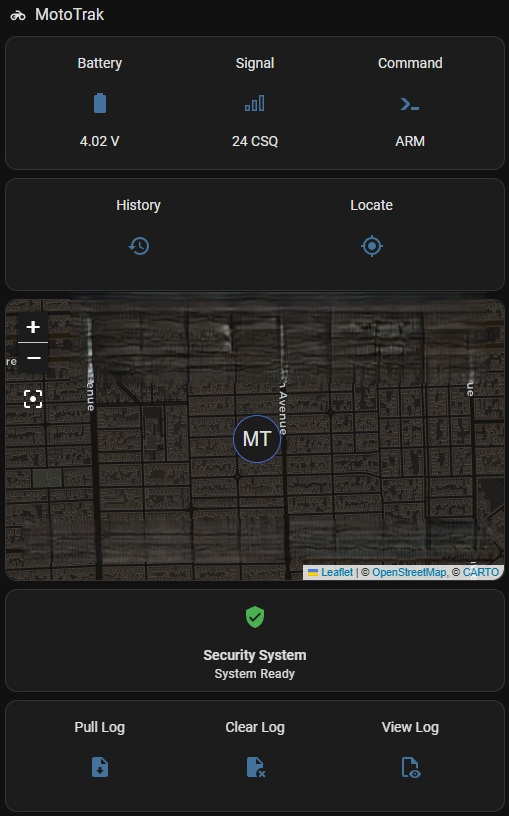

# MotoTrak

A DIY motorcycle GPS anti-theft tracker and alarm built on an ESP32 with cellular connectivity, motion-triggered theft detection, and full Home Assistant integration over MQTT.



*(map redacted)*

## Hardware Used

- **[LilyGo T-SIM7000G](https://github.com/Xinyuan-LilyGO/LilyGo-T-SIM7000G)** - ESP32 dev board with an onboard SIM7000G modem (LTE-M/NB-IoT + GPS)
- **MPU6050** - accelerometer/gyro, used as the motion-triggered theft sensor
- **PN532** - NFC reader for tap-to-arm/disarm (optional - firmware detects its absence at boot and falls back to MQTT-only arm/disarm)
- **21700 Li-ion cell** (a high-drain cell is strongly recommended - the SIM7000 modem draws current spikes up to ~2A during LTE transmit/registration)
- A bulk capacitor across the main battery input, to help buffer those modem current spikes
- 16MB flash (used for a 3MB OTA-capable app partition + 9MB LittleFS partition for debug logging - see `partitions.csv`)

## Features

- **Cellular GPS tracking** over LTE-M, published to MQTT (tested on Google Fi's `h2g2` APN, configurable for any carrier)
- **Motion-triggered theft alarm** - MPU6050 wakes the device from sleep; if armed, motion immediately triggers a theft alert and starts periodic GPS pings
- **NFC tap arm/disarm**, with MQTT ARM/DISARM as a parallel/fallback control path
- **Recovery mode** - if a theft alert isn't cleared within 30 minutes, the device drops into a longer-interval GPS "recovery ping" cycle to conserve battery while still reporting location
- **Aggressive power management** - ESP32 light sleep with a 5-minute idle timeout, hourly heartbeat wake (30-minute in recovery mode), and hard failsafe timeouts so the device never gets stuck awake
- **Battery monitoring** with low/critical voltage thresholds and a validity guard against bogus ADC readings
- **On-device debug logger** - a rotating LittleFS log (boot reasons, sleep/wake events, MQTT/LTE failures, theft triggers, telemetry) that survives reboots/crashes, independent of MQTT connectivity, for real post-mortem diagnosis
- **Full Home Assistant integration** - native alarm panel entity, device tracker, battery/signal sensors, and dashboard controls to arm/disarm, locate, and pull/clear the debug log remotely (see [`home-assistant/`](home-assistant/))

## Implementation

### Connectivity

MQTT over the SIM7000's cellular data connection, using [Adafruit IO](https://io.adafruit.com/) as the broker. Feed topics are all built from a single `SECRET_MQTT_USER` value in `secrets.h`, so they stay consistent automatically:

| Feed | Purpose |
|---|---|
| `motogps/csv` | GPS fixes: `speed,lat,lon,alt` |
| `motobatt` | Battery voltage, in millivolts |
| `motosignal` | Cellular signal quality (CSQ) |
| `motostatus` | Human-readable status/event strings |
| `motocmd` | Inbound commands (`ARM`, `DISARM`, `GPS`, `DUMPLOG`, `CLEARLOG`) |
| `motolog` | Chunked debug-log dump, published on `DUMPLOG` |

### LED indicator

The only feedback available without a phone in hand - one onboard LED, several distinct patterns:

| Pattern | Meaning |
|---|---|
| Off | Disarmed and idle |
| Off (held low) | Light sleep |
| 4 quick flashes, then solid on | Boot or wake-up sequence starting |
| Brief blink every ~5 seconds | Armed and idle (heartbeat pulse) |
| Fast continuous blink | Theft alarm triggered, **or** NFC learn mode active |
| Fast blink for 10 seconds after an armed wake | Waiting for an NFC tap (grace period) before deciding theft vs. legitimate access |
| Two quick flashes | Command confirmed: now armed |
| One long flash (~800ms) | Command confirmed: now disarmed |

### Power/sleep cycle

The device spends almost all of its time in ESP32 **light sleep** (not deep sleep - `setup()` doesn't re-run on a normal wake, so armed/theft state persists across wake cycles without needing RTC-memory tricks). It wakes on:
- A GPIO interrupt from the MPU6050 (motion, only enabled while armed)
- A GPIO interrupt from the PN532 (NFC tag present, if the reader is installed)
- An hourly timer (30 minutes while in recovery/theft-tracking mode)

A true reboot (`setup()` re-running) only happens on power-on, a physical reset, a brownout, or a firmware crash/watchdog reset - which is also exactly what the on-device debug logger's `BOOT` events are for tracking.

### Debug logger

A CSV-formatted log (`millis,batteryV,freeHeap,TAG,message`) stored on a dedicated LittleFS partition, capped in size (`LOG_MAX_BYTES` in the firmware) and rotated to keep two generations. It's deliberately **not** wiped on every boot, so a crash/brownout reboot doesn't destroy the evidence of what led up to it. Pull it over MQTT with the `DUMPLOG` command (chunked, rate-limited to stay under your MQTT broker's throttle), or dump it to serial with the `dumplog` command over USB. Clear it with `CLEARLOG` (over MQTT) or `clearlog` (over serial).

### Home Assistant integration

See [`home-assistant/`](home-assistant/) for ready-to-use config: MQTT entities (sensors, device tracker, native alarm panel, switch, buttons), automations (theft/low-battery/geofence alerts, debug-log dump plumbing), a toggle script, and a dashboard card. That folder's README-style comments explain what needs to be customized (your Adafruit IO username, notification service, etc.) - it's written to be dropped into someone else's HA instance, not just mine.

## Getting Started

### Firmware

1. Copy `secrets.example.h` to `secrets.h` and fill in your Adafruit IO username/key. `secrets.h` is gitignored - it never gets committed.
2. Install the ESP32 board package and these libraries in the Arduino IDE: `Adafruit PN532`, `Adafruit MPU6050`, `Adafruit Unified Sensor`, `PubSubClient`, `TinyGSM`.
3. Board settings: **ESP32 Dev Module**, Flash Size **16MB**, Partition Scheme **Custom** (picks up `partitions.csv` from the sketch folder automatically).
4. Update `apn` in the sketch for your carrier if you're not on Google Fi.
5. Compile and flash.

### Home Assistant

See [`home-assistant/`](home-assistant/) for the config files and setup notes.

## Repo Structure

```
moto_trak_gemini_v7_61.ino    Firmware
partitions.csv                 Custom 16MB partition table (3MB app / 9MB LittleFS)
secrets.example.h              Credential template - copy to secrets.h
home-assistant/                HA integration: MQTT entities, automations, script, dashboard, log viewer
```
